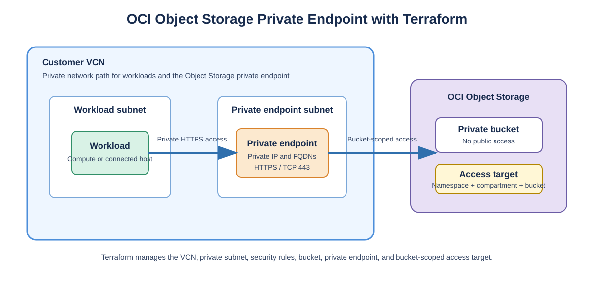
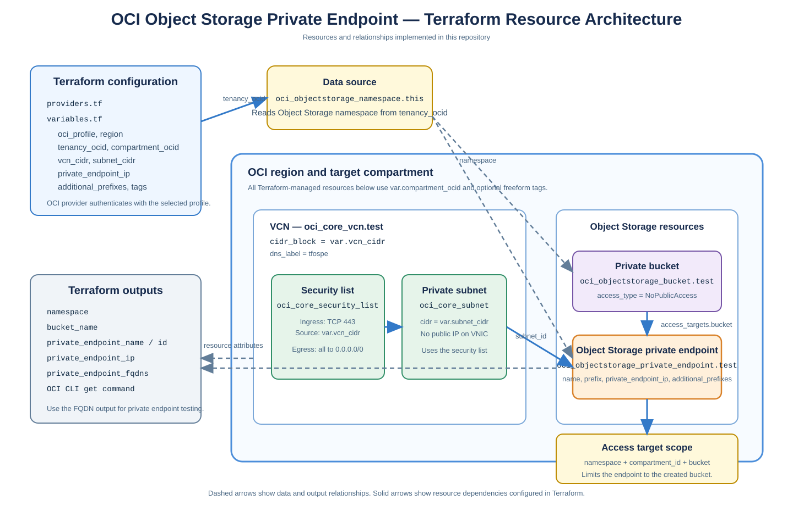

# Private Access to OCI Object Storage with Terraform

## Introduction

OCI Object Storage private endpoints let workloads in a virtual cloud network (VCN) reach Object Storage through a private IP address instead of the public Object Storage endpoint. This is useful when a customer requires private network access to Object Storage, restricts public egress, or wants a controlled path from workloads to a specific set of buckets.

This customer reference provides an English Terraform example for creating an Object Storage private endpoint. It was developed from a proof of concept and is intended as a starting point for repeatable deployments in separate non-production and production environments.

It is an English, customer-facing companion to the [Oracle implementation reference for creating an OCI Object Storage private endpoint with Terraform](https://blogs.oracle.com/lad-cloud-experts-pt/private-endpoint-oci-object-storage-terraform). That supporting article is written in Portuguese; this article presents the same solution area in English with deployment, validation, security, and troubleshooting guidance.

The core Terraform resource is [`oci_objectstorage_private_endpoint`](https://registry.terraform.io/providers/oracle/oci/latest/docs/resources/objectstorage_private_endpoint). The associated OCI service guide is [Using Private Endpoints for Object Storage](https://docs.oracle.com/en-us/iaas/Content/Object/Tasks/private-endpoints.htm).

## Table of Contents

- [Objectives](#objectives)
- [Prerequisites](#prerequisites)
- [Download the Code](#download-the-code)
- [Architecture](#architecture)
- [Deployment Options](#deployment-options)
- [Task 1: Configure Terraform Variables](#task-1-configure-terraform-variables)
- [Task 2: Deploy the Private Endpoint](#task-2-deploy-the-private-endpoint)
- [Task 3: Verify the Private Endpoint](#task-3-verify-the-private-endpoint)
- [Task 4: Test Object Access](#task-4-test-object-access)
- [IAM and Security Considerations](#iam-and-security-considerations)
- [Troubleshooting](#troubleshooting)
- [Clean Up](#clean-up)
- [Summary](#summary)
- [Acknowledgments](#acknowledgments)
- [More Learning Resources](#more-learning-resources)

## Objectives

In this tutorial, you will learn how to:

- Create a VCN, private subnet, and security list for a demonstration environment.
- Create a private Object Storage bucket.
- Create an Object Storage private endpoint with Terraform.
- Scope the endpoint to the bucket through an access target.
- Retrieve the private endpoint FQDNs and test Object Storage access from a host in the VCN.
- Adapt the pattern safely for customer non-production and production environments.

## Prerequisites

Before you begin, ensure you have:

- An OCI tenancy, compartment, and region in which you can create network and Object Storage resources.
- Terraform 1.5 or later.
- OCI Terraform provider 6.31.0 or later.
- OCI CLI or API credentials configured locally.
- A host in the VCN, or a connected network, from which to test the private endpoint after deployment.

The Terraform principal needs permissions similar to the following. Tighten these policies to the appropriate compartment and group for production use.

```text
Allow group <group-name> to manage objectstorage-private-endpoint in tenancy
Allow group <group-name> to manage virtual-network-family in tenancy
Allow group <group-name> to manage buckets in compartment <compartment-name>
Allow group <group-name> to manage objects in compartment <compartment-name>
```

## Download the Code

Clone this repository:

```bash
git clone https://github.com/Johnadewumi25/object-storage-private-endpoint-template.git
cd object-storage-private-endpoint-template
```

The repository contains Terraform configuration only. It does not include OCI credentials, real OCIDs, Terraform state, or provider cache files.

## Architecture

The demonstration configuration creates the following resources:



The architecture separates the workload and endpoint into private network components. Object Storage access is directed through the private endpoint, and the access target scopes the endpoint to the intended bucket.

### Terraform implementation view

The following diagram maps directly to the resources, data source, variables, and outputs in this repository. It intentionally shows only what the Terraform configuration creates or reads; customer connectivity components outside this template are not included.



The `oci_objectstorage_namespace` data source reads the namespace using `tenancy_ocid`. Terraform then creates the VCN, security list, private subnet, private bucket, and Object Storage private endpoint. The endpoint receives its private IP from the private subnet and has an access target restricted to the bucket created by the configuration.

The private endpoint is assigned an IP address in the selected private subnet. Its access target limits the endpoint to the namespace, compartment, and bucket declared in Terraform. The endpoint is not a general replacement for all Object Storage access; access targets should be deliberately scoped to the buckets a workload requires.

## Deployment Options

Choose the model that matches the customer environment:

- **Demo or proof of concept:** Use this repository as supplied. It creates a small VCN, private subnet, security list, bucket, and private endpoint.
- **Existing customer network:** Reuse an approved VCN and private subnet, then adapt the Terraform resources to reference those existing IDs instead of creating new network resources.
- **Separate environments:** Use separate variable files and separate Terraform state for environments such as `ptnonprod` and `ptprod`. Do not apply one environment's state in another environment.

For a production design, confirm DNS resolution, routing, network security rules, and the intended access targets with the customer's network and security teams before applying the configuration.

## Task 1: Configure Terraform Variables

Copy the example variable file:

```bash
cp terraform.tfvars.example terraform.tfvars
```

On Windows PowerShell:

```powershell
Copy-Item terraform.tfvars.example terraform.tfvars
```

Set the values for the customer environment:

```hcl
oci_profile      = "DEFAULT"
region           = "us-ashburn-1"
tenancy_ocid     = "ocid1.tenancy.oc1..example"
compartment_ocid = "ocid1.compartment.oc1..example"

# Change these if they overlap existing customer networks.
vcn_cidr    = "10.42.0.0/16"
subnet_cidr = "10.42.1.0/24"
```

Do not commit `terraform.tfvars`. It can contain customer-specific OCIDs and configuration values, and it is excluded by `.gitignore`.

## Task 2: Deploy the Private Endpoint

Initialize and validate Terraform:

```bash
terraform init
terraform validate
terraform plan
```

Review the plan carefully. Confirm the target compartment, region, VCN CIDR ranges, bucket name, tags, and private endpoint name. When the plan is approved, apply it:

```bash
terraform apply
```

The deployment creates:

- A VCN and private subnet for the endpoint in the demo configuration.
- A security list that allows HTTPS from the VCN CIDR.
- A bucket with public access disabled.
- An `oci_objectstorage_private_endpoint` resource.
- An access target scoped to the created bucket.

## Task 3: Verify the Private Endpoint

Terraform outputs the endpoint name, private IP address, and FQDN details. You can also query the endpoint with the OCI CLI:

```bash
oci os private-endpoint get \
  --namespace-name <namespace> \
  --pe-name tf-os-pe-test-pe
```

Confirm that the lifecycle state is `ACTIVE` and record the Object Storage API FQDN returned in the endpoint details.

In the OCI Console, navigate to:

```text
Storage > Object Storage & Archive Storage > Private Endpoints
```

Select the same compartment and review the endpoint's details, FQDNs, access targets, and tags.

## Task 4: Test Object Access

Run the following test from a compute instance or connected host that can resolve and route to the private endpoint. Create a small test file:

```bash
echo "hello private endpoint" > test.txt
```

Upload it using the Object Storage API FQDN from the Terraform output:

```bash
oci os object put \
  --namespace <namespace> \
  --bucket-name tf-os-pe-test-bucket \
  --name test.txt \
  --file ./test.txt \
  --endpoint https://<object-storage-api-fqdn>
```

Download the object to verify the round trip:

```bash
oci os object get \
  --namespace <namespace> \
  --bucket-name tf-os-pe-test-bucket \
  --name test.txt \
  --file ./downloaded.txt \
  --endpoint https://<object-storage-api-fqdn>
```

## IAM and Security Considerations

- Use least-privilege IAM policies and scope them to the deployment compartment where possible.
- Keep access targets narrow. Grant access only to the buckets and namespaces required by the workload.
- Use separate Terraform state, credentials, tags, and approval processes for non-production and production.
- Do not commit OCI API keys, private keys, local CLI configuration, `terraform.tfvars`, or Terraform state.
- Validate private DNS resolution and VCN routing from the actual workload subnet before moving to production.
- Review egress rules rather than using the demonstration rule unchanged in a customer production environment.

## Troubleshooting

**The Terraform resource is difficult to find in the Registry**

Use the [`oci_objectstorage_private_endpoint`](https://registry.terraform.io/providers/oracle/oci/latest/docs/resources/objectstorage_private_endpoint) resource documentation and the [OCI provider source](https://github.com/oracle/terraform-provider-oci). A useful implementation reference is also available in this [Oracle blog post](https://blogs.oracle.com/lad-cloud-experts-pt/private-endpoint-oci-object-storage-terraform), which is written in Portuguese.

**The endpoint does not become active**

Check the subnet, available private IP capacity, IAM permissions, service limits, and the Terraform provider error message. Confirm that the deployment region supports the required Object Storage private endpoint configuration.

**Object access fails from a workload**

Verify that the workload can resolve the private endpoint FQDN, route to the endpoint IP address, and reach TCP port 443. Confirm that the bucket is included in an access target and that the calling principal has Object Storage permissions.

**Production and non-production deployments interfere with each other**

Use different Terraform backends or state keys, distinct names and tags, and environment-specific variable files. Never share a single state file between environments.

## Clean Up

Destroy the demonstration resources when they are no longer required:

```bash
terraform destroy
```

Before deleting a customer production endpoint, confirm the dependent workloads, DNS references, and change-management requirements.

## Summary

OCI Object Storage private endpoints can be managed with Terraform through `oci_objectstorage_private_endpoint`, even when the resource is not easy to discover in the Registry. This repository gives customers a small, reviewable example that creates the required network path, a private bucket, the endpoint, and a bucket-scoped access target.

Use the example as a starting point, then adapt it to existing customer networking, least-privilege IAM, environment separation, and operational change controls.

## Acknowledgments

- **Author:** John Adewumi (Senior Cloud Architect)
- **Reference implementation:** OCI Object Storage private endpoint Terraform proof of concept.
- **Supporting reference:** [Oracle private endpoint Terraform example](https://blogs.oracle.com/lad-cloud-experts-pt/private-endpoint-oci-object-storage-terraform) (Portuguese). This article is the English, customer-facing companion reference.

## More Learning Resources

- [OCI Object Storage private endpoints](https://docs.oracle.com/en-us/iaas/Content/Object/Tasks/private-endpoints.htm)
- [OCI Terraform provider documentation](https://registry.terraform.io/providers/oracle/oci/latest/docs/resources/objectstorage_private_endpoint)
- [OCI Terraform provider source](https://github.com/oracle/terraform-provider-oci)
- [Oracle blog example (Portuguese)](https://blogs.oracle.com/lad-cloud-experts-pt/private-endpoint-oci-object-storage-terraform)
